# SkySavvy Chrome Extension

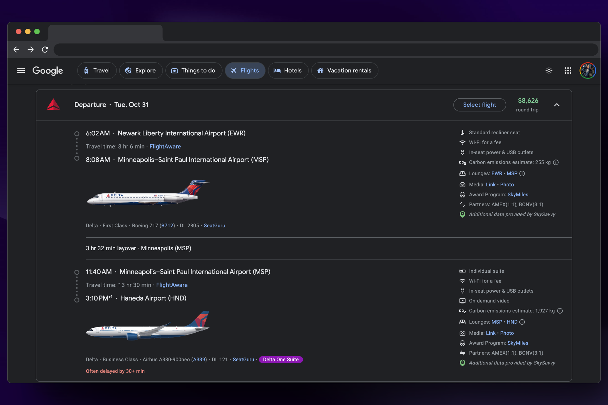

## Install

(Link to Chrome Web Store)

## Background

SkySavvy is a Chrome extension that enhances Google Flights with style changes and additional data in flight search results. As a heavy user of Google Flights, I often found myself searching for flight reviews, more detailed aircraft data, and miles and award transfer information. SkySavvy is my approach to bringing that data directly into the Google Flights UI.

## Features

### Basic Page Style Enhancements
SkySavvy makes several changes to the Google Flights interface:

* Widens the page to reduce clutter and take advantage of widescreen monitors
* Hides the footer that contained unnecessary links
* Hides various annoying disclaimers that cluttered the interface (e.g., "Displayed currencies may differ", "Prices include fees", etc.)
* Hides CO2 emissions data from the top-level of each search result (the same information is still available in the expanded view)
* Supports both light and dark mode

| Before | After |
|--------|-------|
| 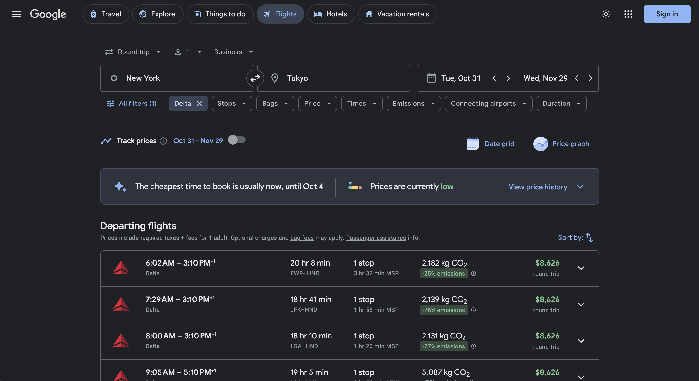   | 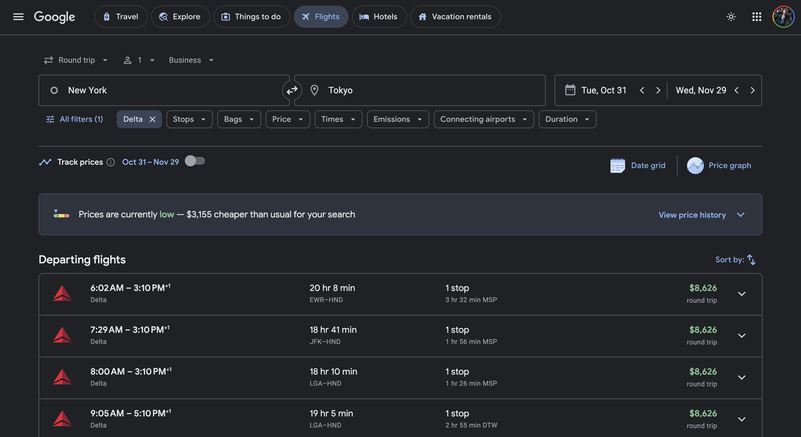  |

### Holiday Highlighting

* SkySavvy highlights holidays (US only for now) in the date-pickers, helping you easily visualize travel dates that may be more expensive.

| Before | After |
|--------|-------|
| 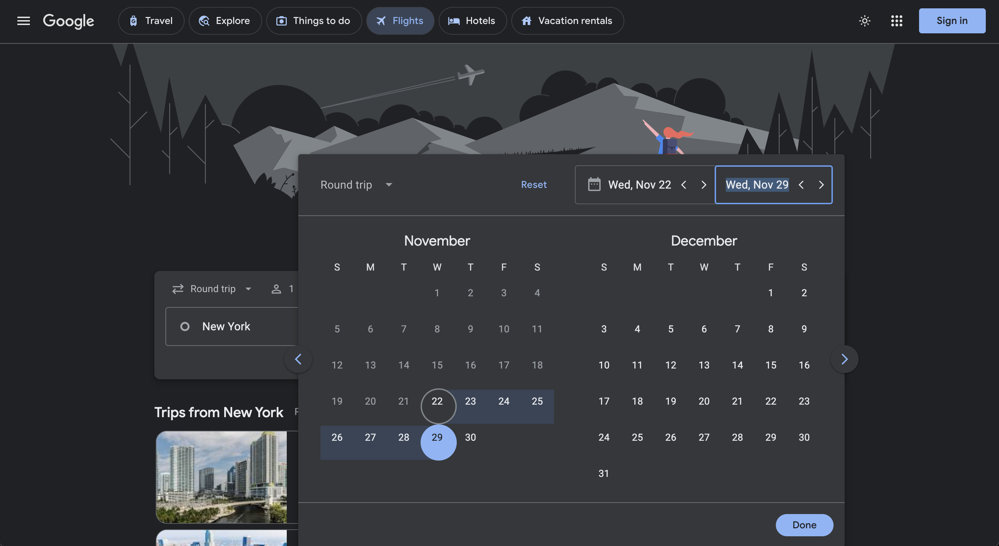   | 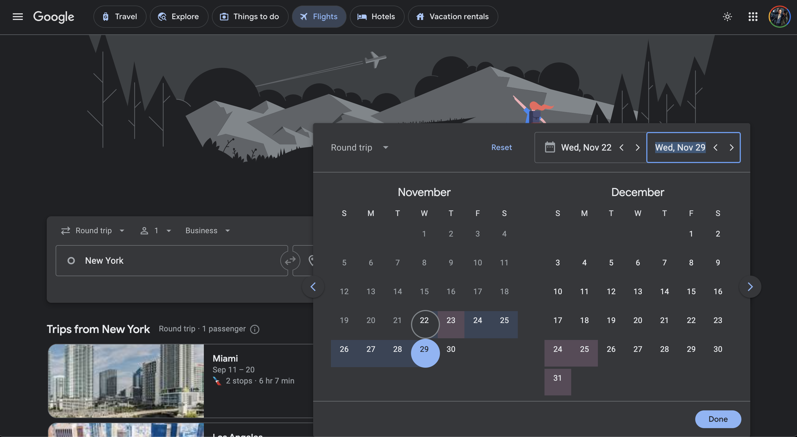  |

### Additional Flight Data
For each supported flight search result, SkySavvy injects additional data about the airports, airline, aircraft, flight, seats, and award programs.

* Adds a FlightAware link for each flight segment
* Adds detailed aircraft IATA code and Wikipedia link
* Adds SeatGuru link for the specific aircraft type
* Adds LoungeBuddy links for lounges in the origin and destination airports
* Adds airline miles award program data
* Adds airline transfer partner data (and point transfer ratios)
* Adds visual call outs for Delta One, Delta One Suites, and Qsuites in business class

| Before | After |
|--------|-------|
| 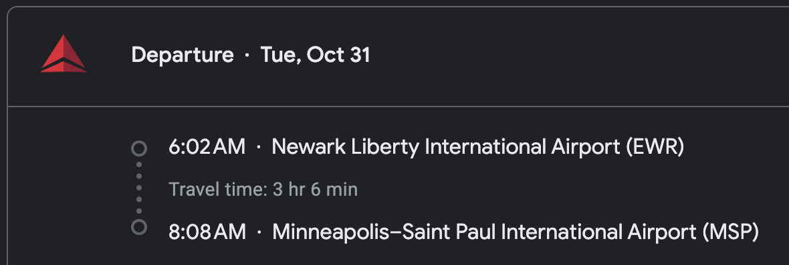   | 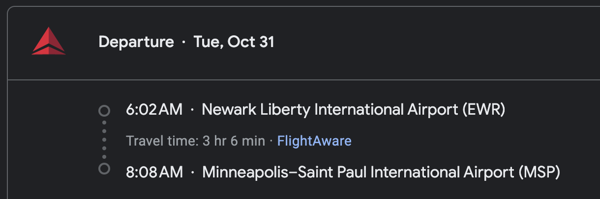  |
| 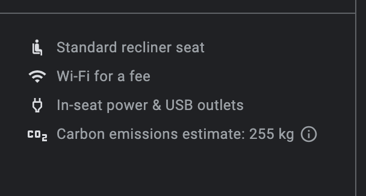   | 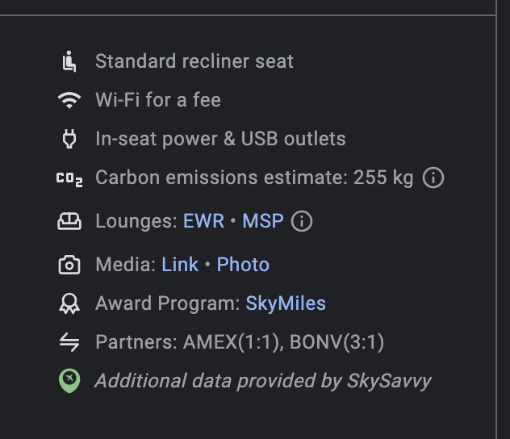  |
| 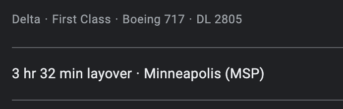   | 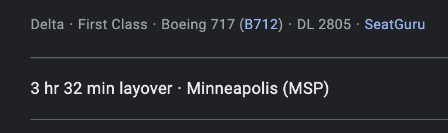  |
|    |   |

### Flight Media
For each supported flight search result, SkySavvy injects photos, videos, and links to relevant flight review blogs, or walkthrough videos. This is useful when flying business class if you want to find out what the seat type and cabin arrangement looks like.

* Adds relevant media of aircraft, cabins, seats, etc.

| Before | After |
|--------|-------|
| 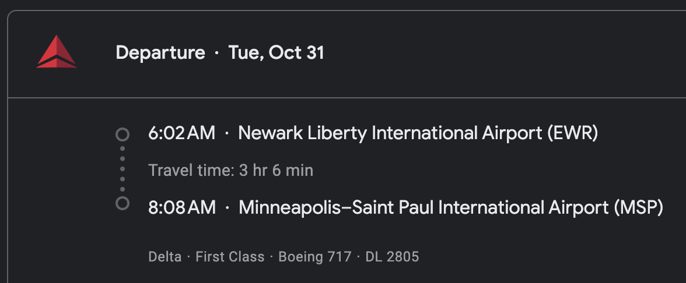   | 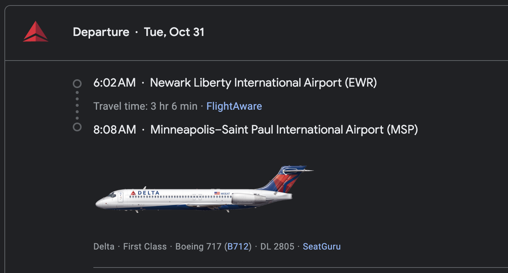  |
| 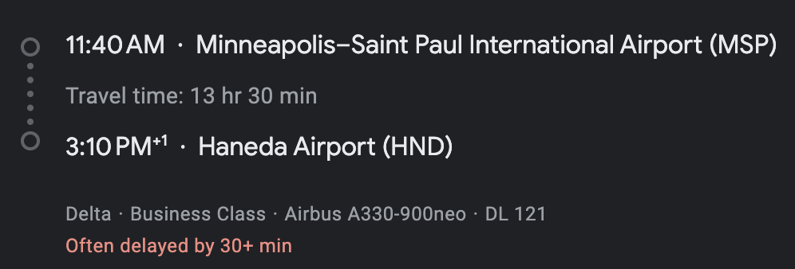   | 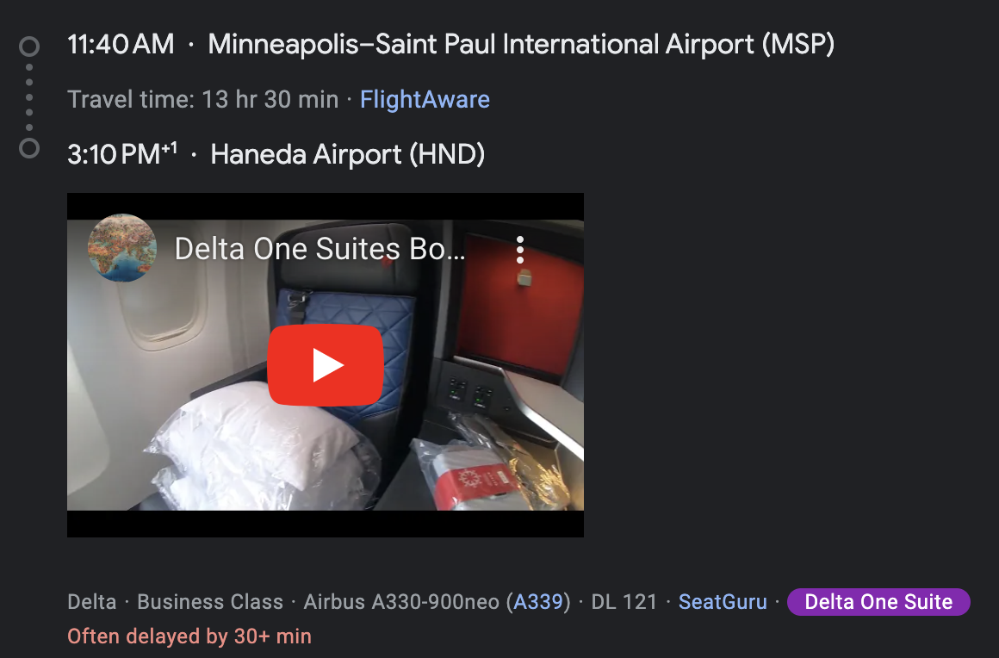  |

### Lightweight and Ad/Tracker-Free
SkySavvy takes your privacy seriously (see [Security and Privacy](#security-and-privacy) below). The SkySavvy extension is designed to work with minimal dependencies, run only on the Google Flights page (no other domains), and does not include any ads, trackers, or other third-party scripts. The entire extension is < 500kb in size.

## Options

SkySavvy supports configuring what page modifications are made. Currently, this includes:

* Enabling/disabling the display of inline media (photos, videos, etc.)
* Enabling/disabling the display of FlightAware links
* Enabling/disabling the display of award program and transfer partner data

These options can be configured by clicking on the extension and checking or unchecking the boxes:

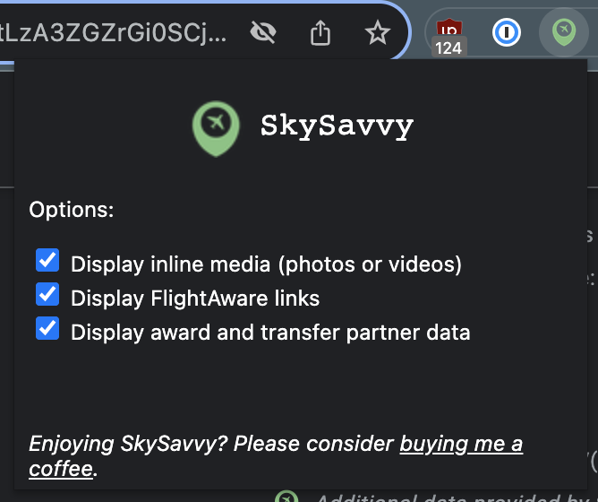

## Security and Privacy

The SkySavvy extension uses Chrome manifest v3 and injects its background script into only pages matching the format `https://www.google.com/travel/flights*`. It requests only the `storage` permission, used to persistently save the configuration options for the extension. A complete copy of the `manifest.json` file can be seen below:

<details>

```json
{
    "manifest_version": 3,
    "name": "SkySavvy",
    "description": "Enhanced Google Flights for aviation enthusiasts",
    "version": "1.0.0",
    "icons": {
        "16": "images/icon-16.png",
        "32": "images/icon-32.png",
        "48": "images/icon-48.png",
        "128": "images/icon-128.png"
    },
    "content_scripts": [
        {
            "matches": [
                "https://www.google.com/travel/flights*"
            ],
            "js": [
                "jquery.min.js",
                "flights.js"
            ],
            "css": [
                "styles.css"
            ]
        }
    ],
    "web_accessible_resources": [
        {
            "matches": [
                "https://www.google.com/*"
            ],
            "resources": ["images/icon-128.png"]
        }
    ],
    "action": {
        "default_title": "SkySavvy",
        "default_icon": {
            "16": "images/icon-16.png",
            "32": "images/icon-32.png",
            "48": "images/icon-48.png",
            "128": "images/icon-128.png"
        },
        "default_popup": "popup/popup.html"
    },
    "permissions": [
        "storage"
    ],
    "host_permissions": [
        "https://www.google.com/travel/flights*"
    ]
}
```

</details>

SkySavvy uses an API, `api.skysavvy.co`, to obtain additional data about each flight segment, which it uses to augment the flight search results. The following is a complete list of the data sent to this API:

* The flight cost (e.g., `$1,500`)
* The flight origin (e.g., `NYC`)
* The flight destination (e.g., `ATL`)
* The airline (e.g., `American Airlines`)
* The flight number (e.g., `DL 123`)
* The cabin type (e.g., `Business Class`)
* The aircraft type (e.g., `Boeing 717`)

Additionally, as part of making an API request, your IP address and browser user agent are transmitted to SkySavvy. Note that this data is only used temporarily to provide a reliable service (i.e. for rate-limiting, avoiding abuse, or debugging issues), but is not saved for longer than 30 days or otherwise used to process or customize the request.

No personally-identifiable information (e.g., name, email, etc.) is sent to SkySavvy.

## FAQ

#### Why should I use SkySavvy?
SkySavvy enhances Google Flights for experienced travelers by improving the interface and adding information, links, photos, and videos to the flight search results.

#### How do I install SkySavvy?
SkySavvy is installed via the Chrome Web Store by clicking "install." No other steps or sign up are required.

#### Does SkySavvy have its own website?
Not at this time. The only way to use SkySavvy is via the Chrome extension.

#### Is SkySavvy safe to use?
Yes. The SkySavvy extension only runs on the Google Flights webpage and does not depend on any third-party code. API calls are made over HTTPS and do not include any personally-identifiable data. SkySavvy does not have any trackers or ads.

#### SkySavvy is showing inaccurate data.
Please report the issue (see [Support](#support) below). Unfortunately, with 10s of 1000s of combinations of airlines, aircraft, airports, and routes, we sometimes have inaccurate data. But we'll do our best to fix it!

## Known Issues
SkySavvy is under active development. We're aware of several issues that may affect your experience using SkySavvy:

* Injected flight data for a search result disappears if you expand another search result. You can get it back by collapsing and expanding the same flight again.
* Injected flight data is not shown on the final flight summary confirmation page
* We currently only have holiday data for 2023. We'll add 2024 soon.
* Some FlightAware links do not match the routes shown by Google Flights. We believe this is due to airlines changing routes > 30 days in the future.
* Some aircraft data may be inaccurate if Google doesn't specify the specific aircraft model. For example: Boeing 767 could be a Boeing 767-300 or 767-400.

## Support
Please use GitHub to file [bug reports](https://github.com/matthewdfuller/skysavvy-docs/issues/new?assignees=&labels=&projects=&template=bug_report.md&title=%5BBUG%5D) or [feature requests](https://github.com/matthewdfuller/skysavvy-docs/issues/new?assignees=&labels=&projects=&template=feature_request.md&title=).

## Roadmap
I have a number of things planned for the next version of SkySavvy. A few sneak peaks:

* Adding additional search filters for things like points transfer partners
* More customized information about business class flights (e.g., which seats are the bes)
* Seat maps from [Aerolopa](https://www.aerolopa.com/)
* Support for more airlines, flights, and aircraft
* Flight review data from popular travel sites
* And more!

## Buy Me a Coffee

[](https://www.buymeacoffee.com/matthewdfuller)

If you've found SkySavvy useful, please consider buying me a coffee to help support server costs.